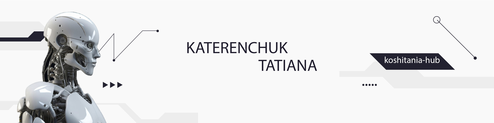

  

  <b>Cześć! 👋 My name is TATIANA and I am an analityk danych.  
  Specjalizuję się w analizie statystycznej i wizualizacji danych.</b>

---

## 📊 Projekty
- **💼 Analiza statystyczna – Projekt Portfelowy**: Badanie danych i wizualizacja kluczowych trendów.  
  Pliki projektu: 
  - [Notebook (.ipynb)](Analiza_statystyczna_Projekt_Portfelowy.ipynb)   
  - [PDF wersja](Analiza_statystyczna_Projekt_Portfelowy.pdf)  
 

---

## 🛠️ Nawyk

  
  
  
  
  
  
  
  
  
  

 

---

## ⚡ Statystyka GitHub

---

## 📫 Komunikacja
- 📧 Email: [koshitania@gmail.com](mailto:koshitania@gmail.com)  
- 🔗 LinkedIn: [linkedin.com/](https://www.linkedin.com/in/tatiana-katerenchuk-6670b1386/)  
- 🐙 GitHub: [koshitania-hub](https://github.com/koshitania-hub)

